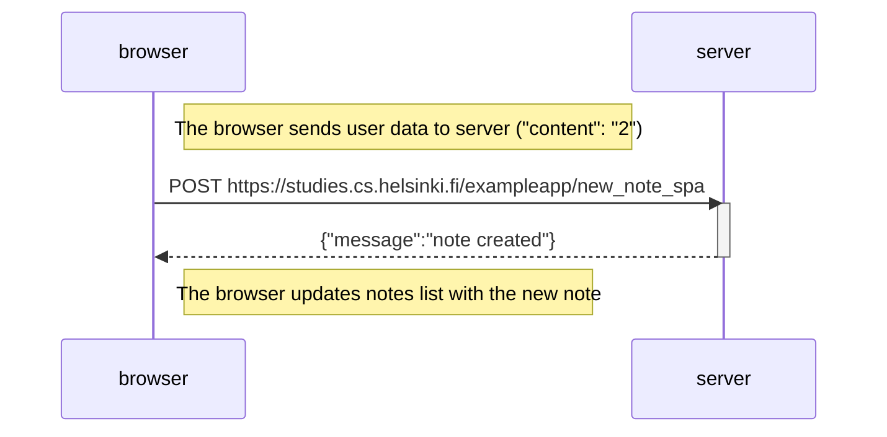

```mermaid
sequenceDiagram
    participant browser
    participant server
    Note right of browser: The browser sends user data to server ("content": "2")
    browser->>server: POST https://studies.cs.helsinki.fi/exampleapp/new_note_spa
    activate server
    server-->>browser:   {"message":"note created"}
    deactivate server
    Note right of browser: The browser updates notes list with the new note
```
